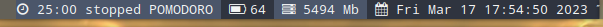

# dwm-config
My build and configurations for my DWM manager

I've started downloading [**dwm-6.4**](https://dl.suckless.org/dwm/dwm-6.4.tar.gz) and umcompressing it.

The process of updating/patching dwm is described (not fully described, though) [here](dwm/patches.md). There is somehow a process showing how I've being patching and changing the configuration files.

## Autostart patch
Since the very beginning I've added autostart patch so a script can be lauched. This script is named **autostart.sh** and it contains the things I want to get launched at startup.

the *nm-applet*, the *volumeicon* and *megasync* are my 3 programs to place in the systray (There is a systray in patch *status2d*).

There is another programs there which are launched:

* ~/.screenlayout/layout.sh -- This is a layout generated with arandr for my screens layout (basically a external screen on the left and my laptop on the right). It can be removed
```
#!/bin/sh
xrandr --output eDP --mode 1920x1080 --pos 1920x0 --rotate normal --output HDMI-A-0 --primary --mode 1920x1080 --pos 0x0 --rotate normal
```

* kbar - I started coding a bar for dwm this afternoon as a proof of concept. I'll upload it to my github in a while. I did it by joining some pieces of code I had around in other Proofs of concept. Maybe I'll improve that some time in the future, simply because I like it better than others Bars for dwm.



* /home/jicg/Personal/KrtPomodoro/server_start.sh - This is basically a Pomodoro tool. It has a timer and helps me to set pomodoro. I had it already in github, [here it is  my KrtPomodoro](https://github.com/jicarretero/MyConfigsLinux/tree/main/KrtPomodoro).

At some point I'll recode that in C. Python wastes quite a lot of RAM.